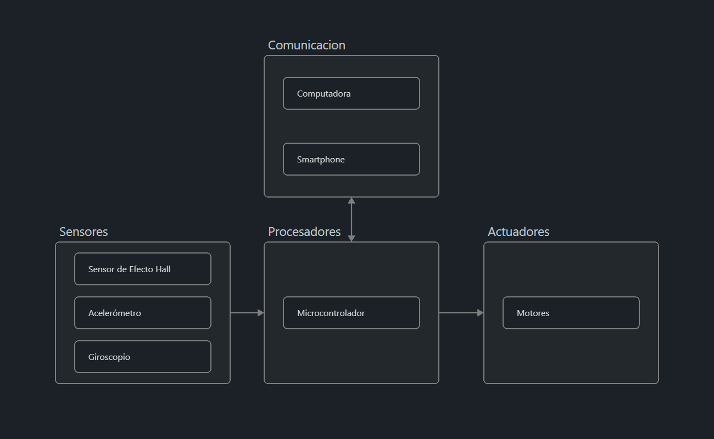

# Ante proyecto | Vega Ferrería <!-- omit from toc -->

### Indice <!-- omit from toc -->
- [1. Descripción de la problemática](#1-descripción-de-la-problemática)
- [2. Características del sistema](#2-características-del-sistema)
- [3. Estado del arte / Antecedentes / Implementaciones previas.](#3-estado-del-arte--antecedentes--implementaciones-previas)
- [4. Estudio de Factibilidad - Investigación de soluciones](#4-estudio-de-factibilidad---investigación-de-soluciones)
- [5. Diagrama de Bloques](#5-diagrama-de-bloques)
- [6. Análisis de Costos](#6-análisis-de-costos)
- [7. Planificación y distribución de Tareas](#7-planificación-y-distribución-de-tareas)

### 1. Descripción de la problemática

### 2. Características del sistema
» Detallar cuáles características serán obligatorias de realizar y cuáles serán las optativas / futuras mejoras

Como caracteristicas obligatorias, el cubo debe contar con un microcontrolador, el acelerómetro y giroscopio como sus sensores, balanceo sobre 1 (uno) de sus ejes para lo que se usaría 1 motor como minimo. Sobre esa base se le puede dar mas funcionalidad, la primera que se piensa abordar es el balance sobre los 3 (tres) ejes del mismo, pasando de balancearse sobre una arista, a balancearse sobre una de sus esquinas. Luego de esto, la implementación de frenos en las ruedas de reaccion para que el mismo pueda "saltar", asi como también la conexion con un dispositivo externo (Computadora / Smartphone) para monitoreo de sensores y/o control del robot.

### 3. Estado del arte / Antecedentes / Implementaciones previas.
» Realizar una investigación de cómo implementar el proyecto y proponer posibles soluciones comparándolas.

### 4. Estudio de Factibilidad - Investigación de soluciones 
» Realizar una investigación de cómo implementar el proyecto y proponer posibles soluciones comparándolas.

### 5. Diagrama de Bloques 
» Realizar un diagrama en donde se detallen los bloques funcionales (no la tecnología empleada) y la relación entre cada uno.
- Describan en detalle cada uno de los bloques y sus relaciones.
- Detallar las etapas que van ser obligatorias de realizar con su funcionamiento y detallar que etapas serán opcionales y de implementaciones futuras

Este diagrama de bloques se divide en 4 (cuatro) partes:
- **Sensores**: En ésta se encuentran los sensores que se utilizarán en el proyecto:
  - Sensor de Efecto Hall: Este sensor determina la posición angular absoluta de cada motor para su manejo de forma precisa.
  - Acelerómetro: Este sensor mide la aceleración del dispositivo, trabaja en conjunto con el giroscópio.
  - Giroscópio: Este sensor sirve para medir, mantener o cambiar la orientación en el espacio del dispositivo.
- **Procesadores**: En ésta se encuentran los elementos de procesado que se utilizarán en el proyecto:
  - Microcontrolador: Este es el encargado de todo el procesamiento y acondicionamiento de los datos enviados desde los sensores hacia el mismo, para luego ser enviados a los actuadores.
- **Actuadores**: En ésta se encuentran los actuadores utilizados en el proyecto:
  - Motores: Éstos son los encargados de cambiar el movimiento angular del dispositivo logrando, con ordenes enviadas del microcontrolador, mantener el dispositivo balanceado.
- **Comunicación**: 

### 6. Análisis de Costos

 Cant |                       Item                      | Precio
:----:|-------------------------------------------------|---------
 1    |          ESP32 - Wi-Fi & Bluetooth MCU          | 4200AR$ / 7U$D*
 1    |      Modulo Acelerometro Giróscopo MPU6050      | 1800AR$ / 3U$D*
 3    |  12-bit Magnetic Rotary Position Sensor AS5600  | 2000 AR$ / 3.3 U$D*
 3    |                     (MOTOR)                     | (PRECIO)*
 1    |                    (BATERIA)                    | (PRECIO)*
Total |                                                 | (PRECIO TOTAL)

*Todos los precios son tasados al (dd/mm/yyyy)
### 7. Planificación y distribución de Tareas
» Identificar las etapas (y sub-etapas) para la realización del proyecto. 
Describir cada una de las etapas (y sub-etapas). 
Identificar, de forma clara y concisa, las correlatividades, los objetivos a lograr en cada una, y los pasos a realizar para concretarlas. 
Distribución de tareas entre los miembros del grupo. 
Diagramación de los tiempos de cada etapa (y sub-etapas)
