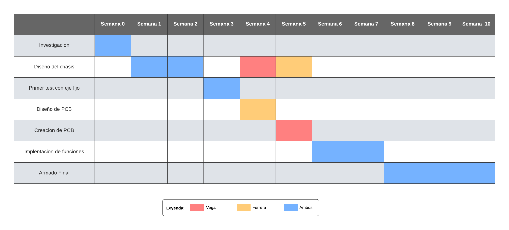

# Ante proyecto | Vega Ferrería <!-- omit from toc -->
## Profesor: Juan Ignacio D'Amore
### Indice <!-- omit from toc -->
- [1. Descripción de la problemática](#1-descripción-de-la-problemática)
- [2. Características del sistema](#2-características-del-sistema)
- [3. Estado del arte / Antecedentes / Implementaciones previas.](#3-estado-del-arte--antecedentes--implementaciones-previas)
- [4. Estudio de Factibilidad - Investigación de soluciones](#4-estudio-de-factibilidad---investigación-de-soluciones)
- [5. Diagrama de Bloques](#5-diagrama-de-bloques)
- [6. Análisis de Costos](#6-análisis-de-costos)
- [7. Planificación y distribución de Tareas](#7-planificación-y-distribución-de-tareas)
  - [Etapas y Sub-Etapas](#etapas-y-sub-etapas)

### 1. Descripción de la problemática
El proyecto presentado consiste del balanceo de figuras, en este caso un cubo, sobre uno o más de sus ejes. Ésto es logrado a través del uso de ruedas de reacción para invertir la caída del cubo, logrando asi la estabilidad del mismo sobre una arista o esquina de este.

Esta tecnología puede ser transpolada a un caso mucho mayor, como el posicionamiento de objetos en el espacio, donde poder reajustar el angulo de estos sin el uso de combustibles.

Junto a su uso en la ingeniería espacial, el proyecto da una introducción a los estudiantes a nuevas tecnologías como el control PID (**P**roporcional, **I**ntegral, **D**erivativo) y abre la puerta para el aprendizaje sobre todo el respaldo que le dá la fisica al mismo. 

### 2. Características del sistema
Como caracteristicas obligatorias, el cubo debe contar con un microcontrolador, el acelerómetro y giroscopio como sus sensores, balanceo sobre 1 (uno) de sus ejes para lo que se usaría 1 motor como minimo. Sobre esa base se le puede dar mas funcionalidad, la primera que se piensa abordar es el balance sobre los 3 (tres) ejes del mismo, pasando de balancearse sobre una arista, a balancearse sobre una de sus esquinas. Luego de esto, la implementación de frenos en las ruedas de reaccion para que el mismo pueda "saltar", asi como también la conexion con un dispositivo externo (Computadora / Smartphone) para monitoreo de sensores y/o control del robot.

### 3. Estado del arte / Antecedentes / Implementaciones previas.
En la búsqueda de soluciones para proyectos similares o relacionados con el control y la estabilidad en la robótica, se pueden encontrar varios antecedentes que destacan por su enfoque en el equilibrio y el movimiento dinámico de objetos. Uno de los ejemplos más notables es el "Cubli" un dispositivo robótico desarrollado por investigadores de ETH Zürich que presenta las siguientes características clave:

- **Equilibrio sobre una esquina**: El Cubli es capaz de mantenerse en equilibrio sobre una de sus esquinas. Esta habilidad demuestra un control preciso del centro de masa y conceptos avanzados de estabilidad.

- **Control de movimiento**: Además del equilibrio estático, el Cubli puede realizar giros y cambios de posición en el aire. Este control se logra mediante ruedas de reaccion controladas de manera individual.

- **Plataforma de investigación**: El Cubli no solo es una creación impresionante por sí misma, sino que también funciona como una plataforma de investigación. Permite explorar y demostrar conceptos avanzados en control, mecánica y dinámica de sistemas robóticos.

- **Aplicaciones potenciales**: Aunque el Cubli puede no tener aplicaciones prácticas directas, sus conceptos y tecnologías pueden ser relevantes para sistemas de estabilización, maniobras espaciales y otras áreas de la robótica donde el control de movimiento y la estabilidad son esenciales.

### 4. Estudio de Factibilidad - Investigación de soluciones 
Como ya se vió antes, éste proyecto ya ha sido construído por investigadores de ETH Zürich y sobre su [paper original](https://folk.ntnu.no/skoge/prost/proceedings/ecc-2013/data/papers/0829.pdf) se basó la matemática empleada en el proyecto.

Luego que dichos investigadores publicaran un [video](https://www.youtube.com/watch?v=n_6p-1J551Y) demostrando el funcionamiento de "Cubli", este se hizo ampliamente famoso, llevando a más personas ajenas al proyecto original a recrearlo. Uno de esos fue un grupo de investigación, entre almunos y profesores del MIT, que demuestran que esta tecnología podria ser usada para robots modulares, que cambiaran su estructura para cada tarea necesaria ([Entrevista Original](https://www.youtube.com/watch?v=6aZbJS6LZbs)).

Por fuera de grandes instituciones como lo es el MIT, numerosos estudiantes y personas aficionadas con la electrónica crearon sus propias versiones del robot "Cubli". Se dejan algunos que se consideran útiles en [este archivo](Resources/Links/Cubli-remakes.md).

Una vez investigado multiples soluciones, se evaluaron cuales partes de cada uno se usarán en este proyecto:

Como microcontrolador se utilizará el ESP32 y algunas de las razones por la que se lo eligió son: Su conectividad inalambrica, ya que cuenta con conexión inalambrica tanto por Wi-Fi como por Bluetooth; Su potente capacidad de procesamiento, este posee una velocidad de reloj de hasta 240 MHz y ofrece una capacidad de procesamiento significativa para ejecutar aplicaciones complejas; Y por último, su amplia gama de periféricos, ya que la placa ESP32 cuenta con una variedad de interfaces y periféricos, como puertos GPIO, UART, SPI, I2C, ADC y DAC, lo que permite interactuar con sensores, actuadores y otros dispositivos.

Como acelerometro y giroscópio se utilizará el módulo MPU6050 ya que este cuenta con un acelerómetro de tres ejes que puede medir la aceleración lineal en las direcciones X, Y y Z.  Este módulo también incluye un giroscopio de tres ejes que mide la velocidad angular de rotación en torno a los mismos ejes (X, Y y Z). Esto permite detectar cambios en la orientación y la rotación. Y por último el MPU6050 se comunica a través del protocolo de comunicación I2C (Inter-Integrated Circuit), lo que lo hace fácil de integrar con el microcontrolador.

Para controlar los motores se necesitarán 2 componentes, un puente H y un sensor de Efecto Hall. Como puente H se utilizará {**PUENTE H**} y como sensor de Efecto Hall se utilizará un sensor absoluto magnetico de 12 bits, que con una interfaz I2C, se comunicará con el ESP32 para informar la posición angular absoulta de cada motor.

### 5. Diagrama de Bloques 

Este diagrama de bloques se divide en 4 (cuatro) partes:
- **Sensores**: En ésta se encuentran los sensores que se utilizarán en el proyecto:
  - Sensor de Efecto Hall: Este determina la posición angular absoluta de cada motor para su manejo de forma precisa.
  - Acelerómetro: Este mide la aceleración del robot, trabaja en conjunto con el giroscópio.
  - Giroscópio: Este sirve para medir, mantener o cambiar la orientación en el espacio del robot.
- **Procesadores**: En ésta se encuentran los elementos de procesado que se utilizarán en el proyecto:
  - Microcontrolador: Este es el encargado de todo el procesamiento y acondicionamiento de los datos enviados desde los sensores hacia el mismo, para luego ser enviados a los actuadores.
- **Actuadores**: En ésta se encuentran los actuadores utilizados en el proyecto:
  - Motores: Éstos son los encargados de cambiar el movimiento angular del robot logrando, con ordenes enviadas del microcontrolador, mantener el robot balanceado.
- **Comunicación**: En ésta se encuentran los canales de comunicación que serán utilizados en el proyecto:
  - Computadora: Esta podrá comunicarse con el robot a través del puerto serial cableado para enviar datos del funcionamiento del mismo y variables del entorno en tiempo real.
  - Smartphone: Estos podrán comunicarse por una conexión inalámbrica, como Bluetooth o Wi-Fi para monitoreo y envio de datos.

### 6. Análisis de Costos

 Cant |                      Item                       | Precio
:----:|-------------------------------------------------|---------
 1    |          ESP32 - Wi-Fi & Bluetooth MCU          | 5400 AR$ / 7,5 U$D*
 1    |      Modulo Acelerometro Giróscopo MPU6050      | 2500 AR$ / 3,5 U$D*
 1    |  12-bit Magnetic Rotary Position Sensor AS5600  | 2000 AR$ / 2,7 U$D*
 1    |                  TT MOTOR DC 6V                 | 1500 AR$ / 2 U$D*
 1    |               Doble Punte H L298N               | 3000 AR$ / 4 U$D*
 2    |             Pila 18650 4.2V 7800mAh             | 1500 AR$ / 2 U$D*
 |     |                                                | Total: 17.400 ARS / 24 U$D

*Todos los precios son tasados al (18/08/2023)

### 7. Planificación y distribución de Tareas

* El tiempo comprendido comienza el 17/8/2023 (Semana 0) y termina el 3/11/2023 (Semana 10)

#### Etapas y Sub-Etapas
- **Investigación:** Investigamos implementaciones anteriores del proyecto en otros entornos y como implementarlas al nuestro con nuestros componentes.
- **Diseño de Chasis:** Ésta etapa está dividida en dos partes, en la primera se diseñará un prototipo el cual será una sola cara del cubo con un agujero en una esquina el cual se fijara a un punto fijo que pivota. En la segunda se diseñará el chasis con forma de cubo para poder hacer un montaje de los componentes final.
- **Primer Test con Eje Fijo:** En este período se harán las primeras pruebas de sensores y motores, en un chasis que tiene un único eje de movimiento para facilitar la implementación.
- **Diseño de PCB:** Diseño de un shield para la placa ESP32, su función será tener las conexiónes entre el microcontrolador, los sensores y los actuadores.
- **Creación de PCB:** Armado físico del PCB ya diseñado, junto con el montaje de componentes.
- **Implementación de Funciones:** Vamos a ir implementando funciones y probandolas mientras progresamos.
- **Armado Final:** Montaje de componentes en el chasis, calibrado de sensores y actuadores para el correcto funcionamiento
